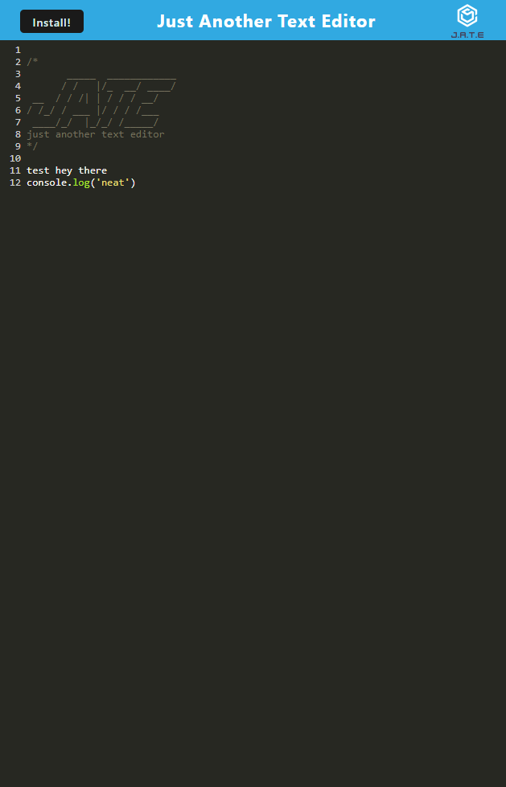

# just-another-progressive-web-text-editor

[](https://opensource.org/licenses/MIT)


## Description
A text editor application that uses Progressive Web Application criteria that can function online as well as offline.

## Table of Contents

- [Installation](#installation)
- [Usage](#usage)
- [Tests](#tests)
- [Credits](#credits)
- [License](#license)
- [Questions](#questions)

## Installation
You may need to install the following packages...

Run ```npm install``` to install necessary node-modules to use on a local machine

## Usage
Link to Application: https://pure-wildwood-68615.herokuapp.com

Run ```npm run start``` to start application from a local server or click the link below to see the live deployed version on Heroku



## Tests
None

## Credits
[Starter Code](https://github.com/coding-boot-camp/cautious-meme)


## Questions?

- Github: https://github.com/jminor90

- Email: minor.jbm@gmail.com

